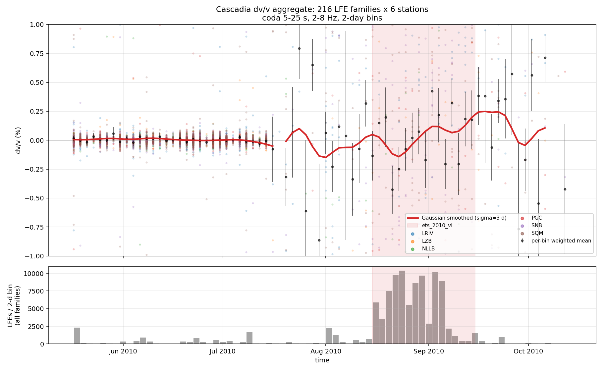

# tremorferometry

LFE coda-wave interferometry for dv/v across Cascadia ETS events.

## Idea

Use Low-Frequency Earthquake (LFE) families as **repeating sources** for
coda-wave interferometry, and track temporal velocity changes (dv/v) at the
plate interface across ETS cycles. LFEs sit on the megathrust / transition
zone, so the dv/v sensitivity kernel is biased toward the slipping patch —
distinct from ambient-noise dv/v, which is dominated by shallow crust.

## v1 result (2010-08 V.I. ETS) — pipeline works; assumption broken

We built and ran the full end-to-end pipeline on the Aug-Sep 2010 V.I. ETS:



- 217 LFE "families" (0.1° grid bins) × 6 V.I./Olympic broadbands × 76 two-day
  bins → 5,948 dv/v measurements via stretching.
- All QC checks defined in `qc.py` pass (spatial coherence 89%, coda-window
  stability across [18,30] / [20,32] / [22,34] s).

**Critical caveat:** when we then verified the foundational CWI assumption —
that detections in each "family" produce a repeating waveform — we found
that **they don't** (see `figures/smoke_family_similarity.png` and
`figures/smoke_reclust_L0000_PGC.png`):

- Bin-to-bin coda CC within a single 0.1° family is essentially zero
  (mean −0.002, 0 % of pairs above 0.5).
- Detection-to-detection direct-phase CC across the 2,365 detections in
  the densest cell L0000 has **0 %** of pairs above CC 0.5, even with
  ±2 s time-shift allowance.

So the numerical dv/v values reported above are statistically valid
stretching computations on the bin-stacks, but each bin-stack is a *different
mixture of distinct LFE sub-sources*, not a measurement of the same
repeating LFE. The values measure source-mixture noise, not medium dv/v.

The path to a real measurement requires either:

1. Waveform-similarity reclustering (network autocorrelation a la
   Brown-Beroza-Shelly 2008) to recover real Bostock-style families from
   the continuous data;
2. Obtaining Bostock's published family templates (not openly hosted);
3. Pivoting to ambient-noise CWI for the same period (loses plate-interface
   sensitivity).

See `notes/METHODS.md` for the full methods, results, the diagnostic that
turned up this finding, and the v2 plan.

## Catalogs

- **PNSN tremor catalog** (Wech envelope-correlation method;
  `https://tremorapi.pnsn.org/api/v3.0/events`) — used to identify and time
  ETS episodes. Implementation: `src/tremorferometry/pnsn.py` and
  `scripts/00b_fetch_pnsn_tremor.py`.
- **Lin (2023) LFE catalog** (Zenodo `10.5281/ZENODO.10016020`) — 1.05 M LFE
  detection times + locations for southern Vancouver Island 2005–2017.
  Ingest: `src/tremorferometry/lin_catalog.py` and
  `scripts/02b_ingest_lin_catalog.py`. We cluster Lin's per-event records
  into 217 "proto-families" by 0.1° grid binning (limitation: see
  per-family analysis section in METHODS).

## Pipeline

```
00b PNSN API         -> tremor CSV
01  tremor CSV       -> episode (t_start, t_end, bbox)
02b Lin Zenodo CSV   -> families + detection-times parquet
04  FDSN             -> per-day MSEED waveform cache (parallel ThreadPool)
06  detections + MSEED -> per-family HDF5 stacks
                          (flat (family, station) ProcessPool)
07  stacks + ref     -> dv/v(t) parquet via stretching
09  dv/v parquet     -> aggregate figure + QC

Optional / for time periods outside Lin's coverage:
05  templates + data -> EQcorrscan + fast-matched-filter (GPU) detections
```

Scripts under `scripts/` are numbered and idempotent; each takes `--config`.

## Repo layout

```
configs/        # one YAML per ETS episode
catalogs/       # ingested catalog tables (gitignored, reproducible)
scripts/        # numbered thin CLIs
src/tremorferometry/  # the package
tests/          # pytest, 12 tests passing
notes/          # METHODS.md and other write-ups
data/           # gitignored; waveforms, detections, stacks, dvv
figures/        # tracked smoke + result figures
```

## Install

A dedicated conda env at `/home/jovyan/envs/tremorferometry` has the full
stack installed (obspy, eqcorrscan, fast-matched-filter built against
CUDA 12.4, plus this package in editable mode). Activate with

```bash
mamba activate /home/jovyan/envs/tremorferometry
```

To recreate from scratch on another host:

```bash
mamba create -p /path/to/env -c conda-forge python=3.11 \
  numpy scipy pandas matplotlib h5py pyarrow pyyaml \
  obspy eqcorrscan joblib tqdm pytest
mamba activate /path/to/env

# fast-matched-filter (GPU template matching, needs nvcc on PATH; optional
# for v1 since we use Lin's detection times directly).
pip install --no-build-isolation \
  "git+https://github.com/beridel/fast_matched_filter.git"
FMF=$(python -c "import fast_matched_filter, os; print(os.path.dirname(fast_matched_filter.__file__))")
mkdir -p $FMF/lib && cd $FMF/src
gcc -O3 -fopenmp -fPIC -march=native -shared matched_filter.c \
    -o $FMF/lib/matched_filter_CPU.so
nvcc -O3 -Xcompiler "-fPIC -fopenmp" -shared matched_filter.cu \
     -o $FMF/lib/matched_filter_GPU.so

pip install --no-deps --no-build-isolation -e .
```

## Reproduce v1 end-to-end

```bash
mkdir -p data/raw_lfe
curl -fsSL -o data/raw_lfe/lin2023_lfe.csv \
    'https://zenodo.org/records/10016020/files/EQloc_001_0.1_3_S.csv?download=1'

python scripts/02b_ingest_lin_catalog.py --config configs/ets_2010_vi.yaml \
    --raw data/raw_lfe/lin2023_lfe.csv

python scripts/04_fetch_waveforms.py --config configs/ets_2010_vi.yaml --workers 24

python scripts/06_stack_bins.py --config configs/ets_2010_vi.yaml \
    --detections data/detections_lin_ets_2010_vi.parquet \
    --selected catalogs/lin_families_ets_2010_vi.csv \
    --waveforms data/waveforms --out data/stacks --workers 48 \
    --fs 40 --pre-s 5 --post-s 35

python scripts/07_measure_dvv.py --config configs/ets_2010_vi.yaml \
    --stacks data/stacks --out data/dvv/v1.parquet --workers 16 --fs 40

python scripts/09_aggregate_plot.py --config configs/ets_2010_vi.yaml \
    --dvv data/dvv/v1.parquet \
    --detections data/detections_lin_ets_2010_vi.parquet \
    --out figures/v1.png
```

## Status

v1 complete: end-to-end pipeline on real 2010-08 V.I. ETS data, multi-station,
multi-family, with QC checks. The remaining open work (waveform-similarity
family reclustering, frequency-band split, margin-wide extension to other LFE
catalogs) is captured in `notes/METHODS.md` § 6.
